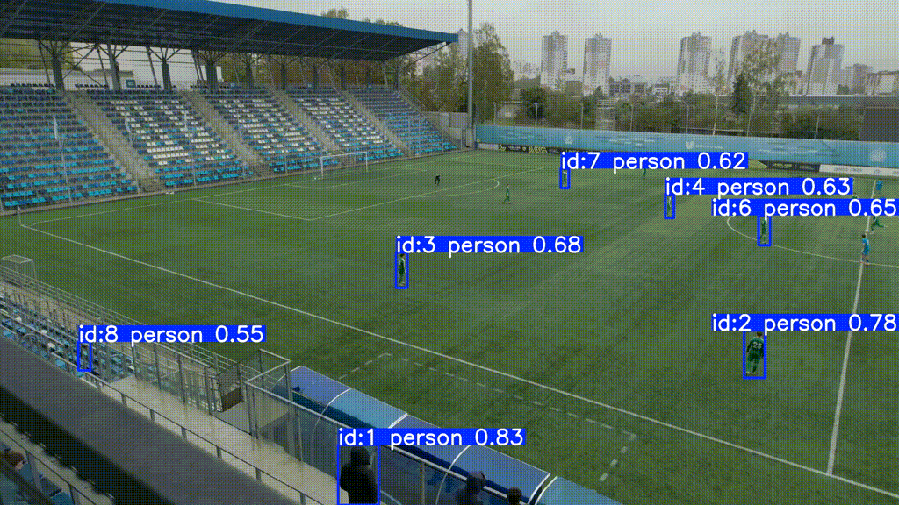

# Crowd Tracking with YOLOv11 + ByteTrack

This project implements **crowd tracking** in video using a custom-trained **YOLOv11l** model combined with the **ByteTrack** multi-object tracking algorithm.

The goal is to accurately detect and track people in crowded environments, with robust handling of occlusions and small-scale targets.

---

## 📂 Dataset

The detector was fine-tuned on the [**MOT20** dataset](https://motchallenge.net/data/MOT20/), which contains high-density pedestrian scenes captured in urban environments.

---

## 🧠 Model

- Base: [`YOLOv11-l`](https://github.com/ultralytics/ultralytics) (large version)
- Pretrained on: COCO
- Fine-tuned on: MOT20
- Tracker: `ByteTrack` with optional Re-ID (`osnet_x0_25`)
- Inference settings:
  - `conf=0.6`
  - `track_buffer=30`
  - `match_thresh=0.65`
  - `min_box_area=25`

---

## 🎥 Evaluation Video

Tracking was evaluated on a **real-world crowded scene** from YouTube:

📹 **Video:** "Crowded Streets in Japan"  
🔗 [https://www.youtube.com/watch?v=0nTO4zSEpOs](https://www.youtube.com/watch?v=0nTO4zSEpOs)

The video demonstrates the model’s ability to track 10–30 individuals across dense pedestrian traffic, with relatively stable ID assignment even in cases of partial occlusion.

---
### 🎞️ Inference Result (GIF)


---

## 🧪 Generalization to New Environments

The model was evaluated not only on dense pedestrian scenes like in MOT20, but also on **completely different conditions** — specifically, a **football match** recorded from a panoramic camera.

Despite these drastically different visuals (field, camera angle, player movement), the detector successfully identifies and tracks players without prior exposure to such data during training.

📸 **Example: Football Match Tracking Result**



---

## 🛠️ Running Inference

To run inference on a video:

```python
from ultralytics import YOLO

model = YOLO("path/to/your/best.pt")
model.track(
    source="video.mp4",
    tracker="bytetrack.yaml",
    conf=0.6,
    show=True,
    save=True
)
```
